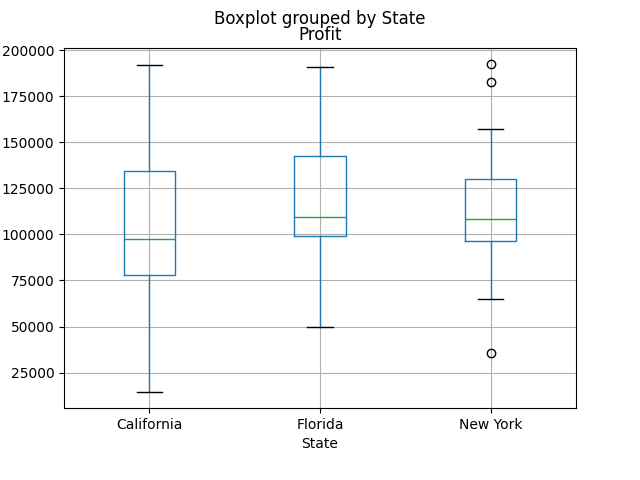
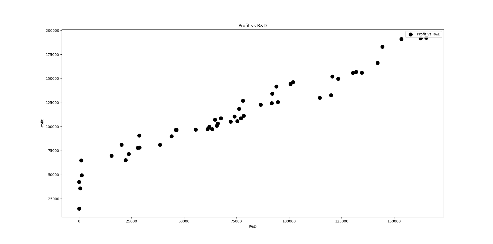

<<<<<<< HEAD
# VC_Startups_LinearRegression

This project performs multiple linear regression on a dataset of startup investments to predict profit.

## 📁 Files
- `linear regeressiin 1.py`: Main Python code
- `VC_Startups.csv`: Dataset
- `images/`: Output plots and result images

## 📊 Visualizations
### Profit vs R&D Spend

### Box Plot: Profit by State
 
=======
# VC_Startups_LinearRegression

This project performs multiple linear regression on a dataset of startup investments to predict profit.

## 📁 Files
- `vc_startups_linear.py`: Main Python code
- `VC_Startups.csv`: Dataset
- `screenshots/`: Output plots and result images

## 📊 Visualizations
### Profit vs R&D Spend

### Box Plot: Profit by State

### OLS Summary Output

>>>>>>> 36caba3 (Initial commit: VC Startups Linear Regression project)
